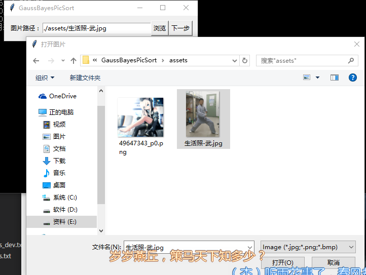
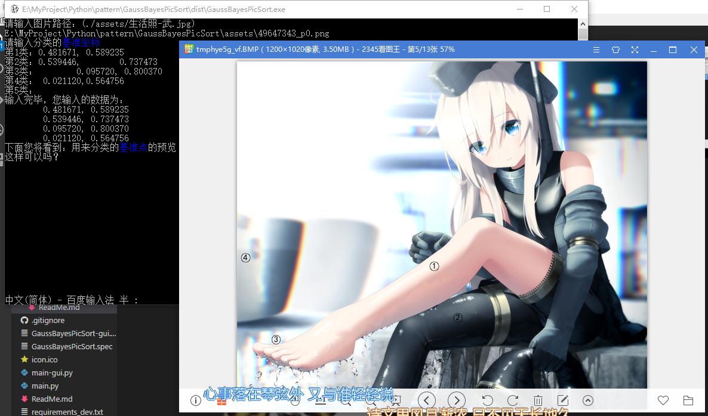
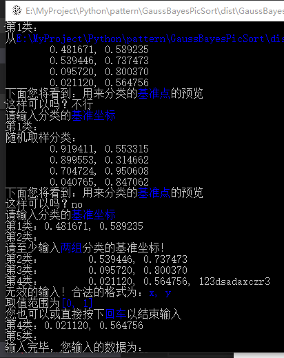
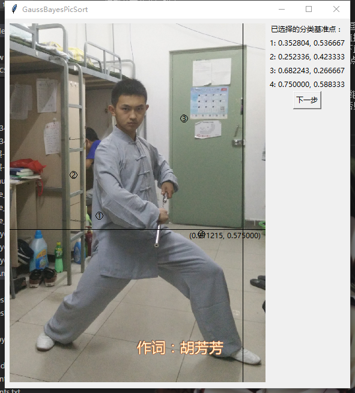
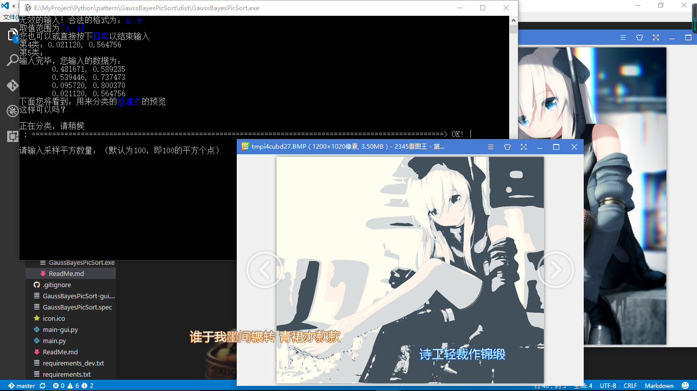
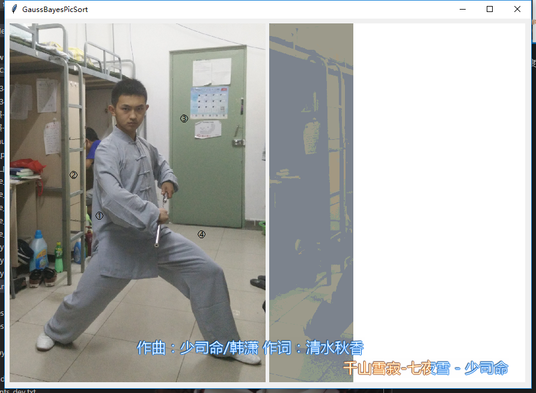
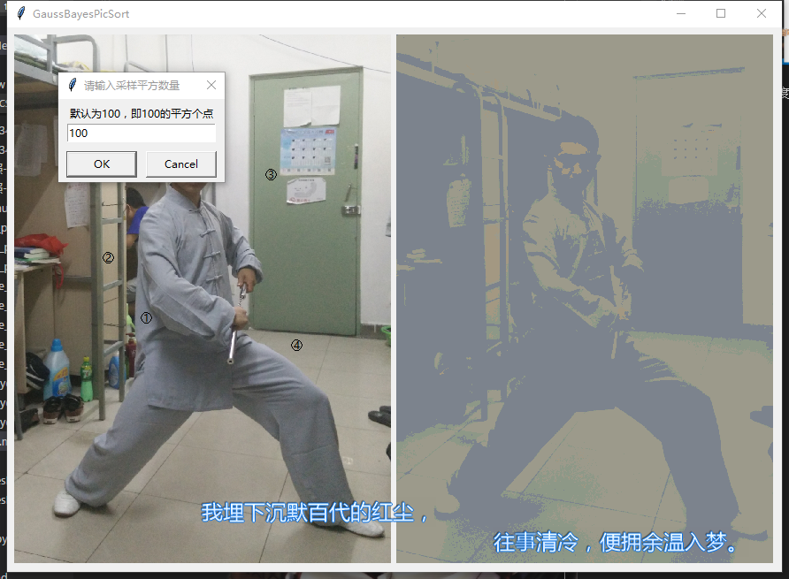
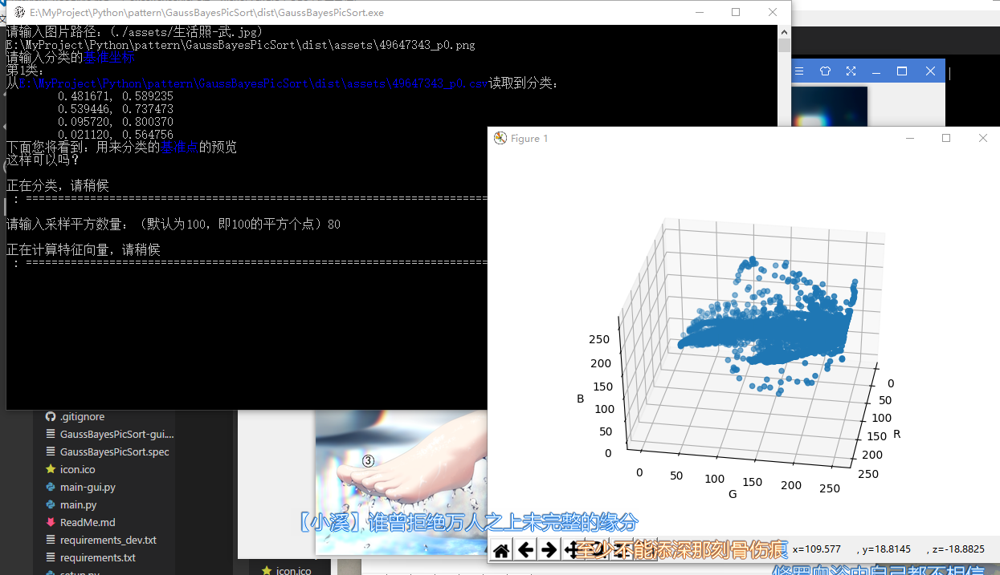
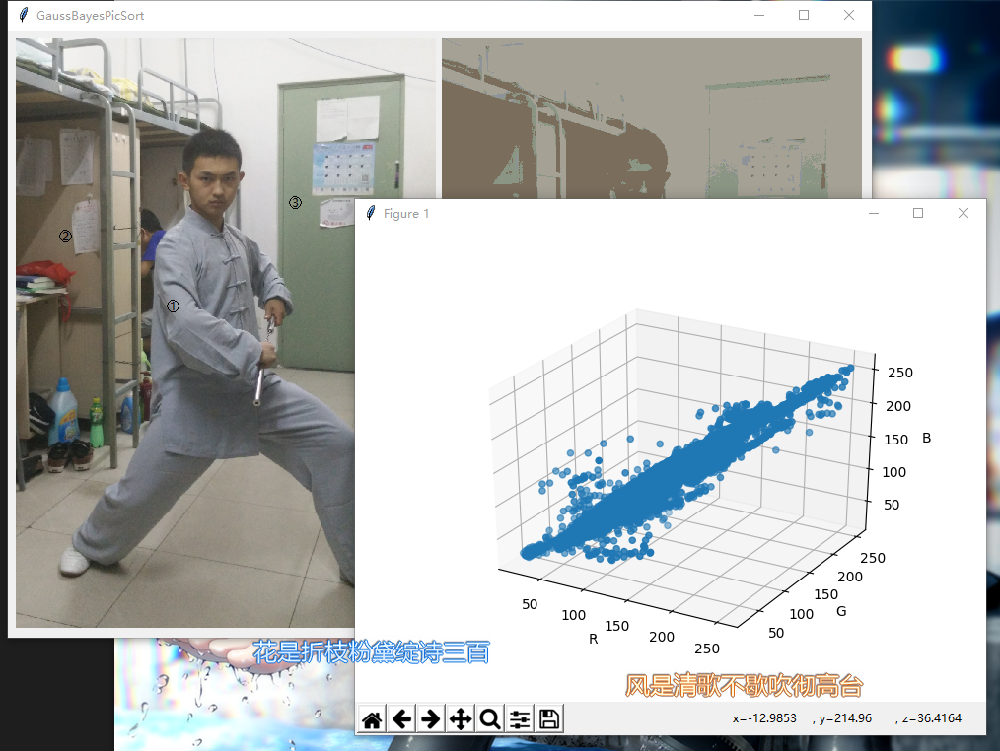
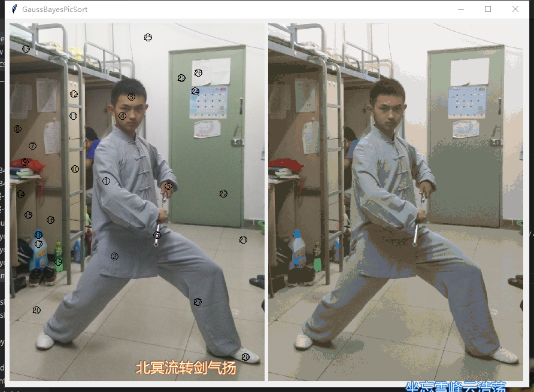

# GaussBayesPicSort
## 模式识别大作业 - 图片的贝叶斯分类器分类

***
### 使用流程及应用展示：

#### 1. 选择图片：

- 控制台版本从命令行输入

    

    当直接回车时将读取默认路径图片（./assets/生活照-武.jpg）,相对路径是从打开程序的文件夹开始的，若输入路径无效或不可读将继续询问输入

- GUI从文件浏览器选择

    

    也可以直接在输入框输入，当确认选择后点下一继续

#### 2. 选择分类基准点

- 控制台在命令行输入

    

    输入格式为'x, y'，即输入横坐标加逗号加纵坐标，前后及坐标逗号间空格均无严格要求，回车录入一个点的坐标，至少输入两个点后，直接回车结束输入，也可以继续输入更多的点。若一个点都不输入的情况下直接回车，会自动在图片路径下查找同名的csv数据文件，从中读入坐标点。对于无效的输入会给出提示，并重新输入该点。

    

    输入完毕后，会在 图片上标出选取的基准坐标点，询问是否可以继续。若检测到用户输入关键词“否”、“不”、“N”，“n”,则重新录入，否则继续下一步，

- GUI在图片上点选

    

    鼠标移动到图片上可以看到当前坐标，点击左键即可录入该点，至少录入两点后，右侧会出现下一步按钮，可以点击进行下一步，当然也可以继续选择

#### 3. 开始分类

- 控制台分类

    
    
    
    
    这没啥好解释的，等待进度条到100%分类完毕就好了

- GUI分类

    
    
    
    
    同样没啥好解释的，等图片分类完毕就好了

#### 4. 特征空间绘制

- 控制台输入取样平方数量

    

    取样平方数量是为了防止图片较大的情况下绘制的点过多，这里输入了80，表示长宽方向各取80个点，即总共抽取 80 × 80 = 6400 个点来绘制特征空间。默认值如图，100。

- GUI输入平方采样数量

    

    同控制台版本，这里取了默认值100，即绘制了10000个样本点。且这里的坐标轴方向才是默认的坐标轴方向，x、y、z轴沿右手螺旋方向首尾相接，之前那个图里的坐标轴是我扰数值轴顺时针旋转90度了的。

***
### 最后，展示下当分类点足够多时的效果！

